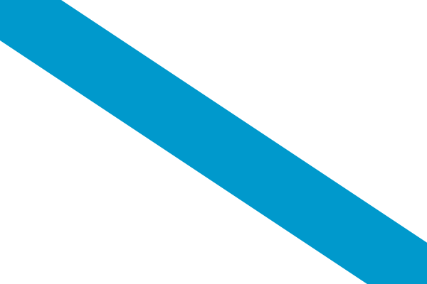
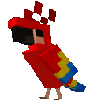

<table align="right">
 <tr><td><a href="https://github.com/AnxoV/AnxoV/blob/output/README.md"> Español</a></td></tr>
 <tr><td><a href="https://github.com/Carol42/Carol42/blob/output/README.gl-ES.md">  Galego</a></td></tr>
</table>

# Ola , son Anxo 
Grata benvida, tú, quén busca coñecemento. Ante ti móstrote o meu perfil, un sumario do meu traballo e entendemento.

## Sobre min

### 💼 Qué fago?
* Estudando un ciclo superior de Desenvolvemento de Aplicacións Web

### 💻 Con qué traballo?
| Front End | Back End | Lenguaxes |
| --------- | -------- | --------- |
|  |  |  |

### 📊 Resumo

| 🏆 Logros | 📈 Estatísticas |
| --------- | --------------- |
|  |  |

  
<h3>Proxectos</h3>

 
**🚧 O resto están construíndose 🚧**
  

## Miscelánea

### 🐍 Unha serpe coméndose os meus commits

